# 20241231_chiangrai

<html>
<head>

<meta charset="UTF-8">
<meta http-equiv="Content-Type" content="text/html; charset=UTF-8">
<meta http-equiv="X-UA-Compatible" content="IE=EmulateIE10" />
<meta http-equiv="X-UA-Compatible" content="IE=edge">

<!--ここから上はお決まりの定型文です-->

<!--ここからが表現の書式などを決めるcssという部分-->

<link href="https://cdnjs.cloudflare.com/ajax/libs/lightbox2/2.7.1/css/lightbox.css" rel="stylesheet">

</head>

<body>

モバイル端末をお使いの場合は、画面を横向きにすると
より見やすくご覧頂けます。

<!--ここ上は、ほぼそのまま使います！-->

<!--QRコードの挿入例-->

 アクセス用QRコード

<marquee direction="left" scrollamount="20" width="30%">(^_^)/~alis</marquee>

<!--流れ文字の挿入例-->
<h1><marquee behavior="left">!!! 2024/12/31 、いつものチェンライ、メーチャン近郊の諸々です !!!</marquee></h1>

                          

<!--ここから下が、本体部分-->

<h2>今回訪れたお店は、新しすぎてGoogleMapsには反映されてませんね〜 ↓</h2>
<iframe src="https://www.google.com/maps/embed?pb=!4v1735641684920!6m8!1m7!1siogSegP1pJiqrTgnYxB8sQ!2m2!1d20.1390599361458!2d99.85653229469605!3f316.1202745966913!4f0.017449314095827617!5f0.7820865974627469" width="600" height="450" style="border:0;" allowfullscreen="" loading="lazy" referrerpolicy="no-referrer-when-downgrade"></iframe>

<h2>現地の近場の足は原付レベルですが、こちらに住み着いた白人さんたちの足は大型バイクが多いようです !</h2>

<h2>ここから規模の大きな雑貨屋さん情報 !</h2>
<a href="20241231_003.JPG" target="_blank">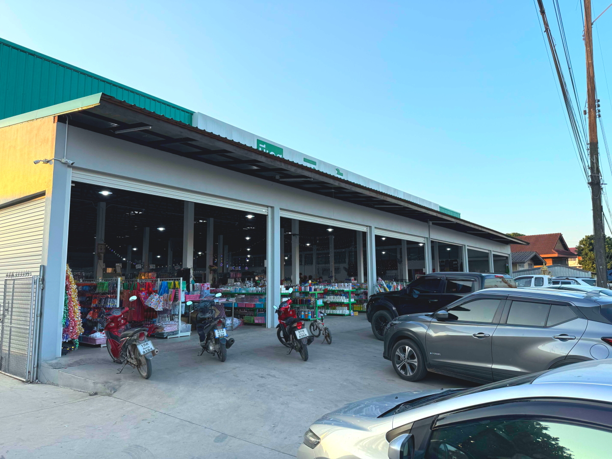</a>
<a href="20241231_004.JPG" target="_blank">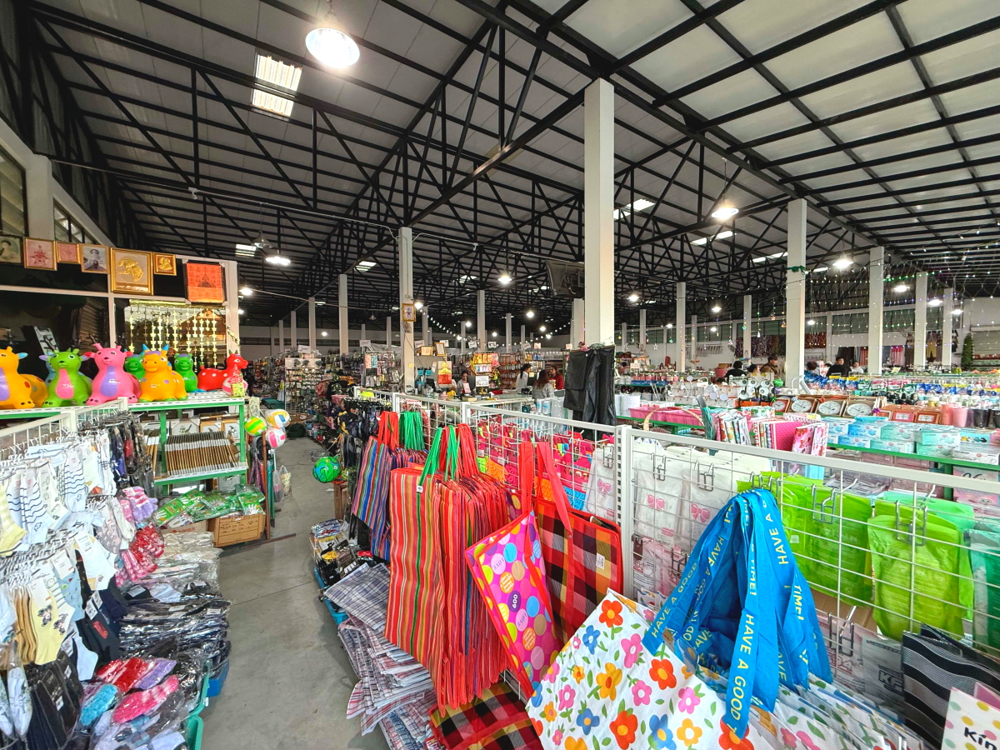</a>

<h2>電卓はCALAO !</h2>
<a href="20241231_005.JPG" target="_blank">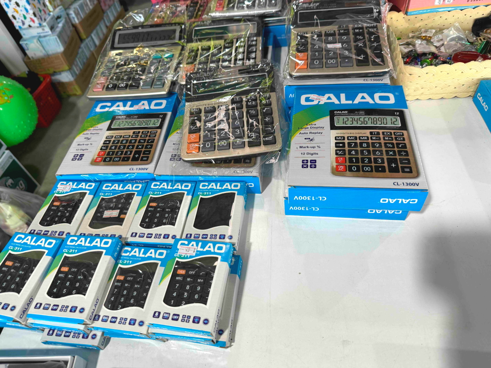</a>

<h2>車のエンブレムを張り替えるニーズ有り？!</h2>
<a href="20241231_006.JPG" target="_blank">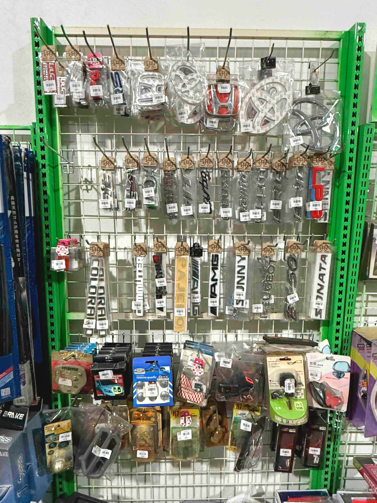</a>

<h2>こちらは仏壇関連グッズ !</h2>

<a href="20241231_010.JPG" target="_blank">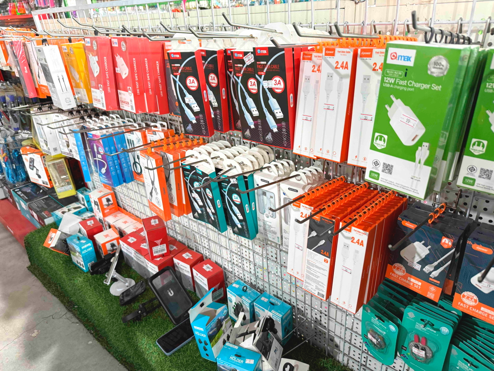</a>
<a href="20241231_011.JPG" target="_blank">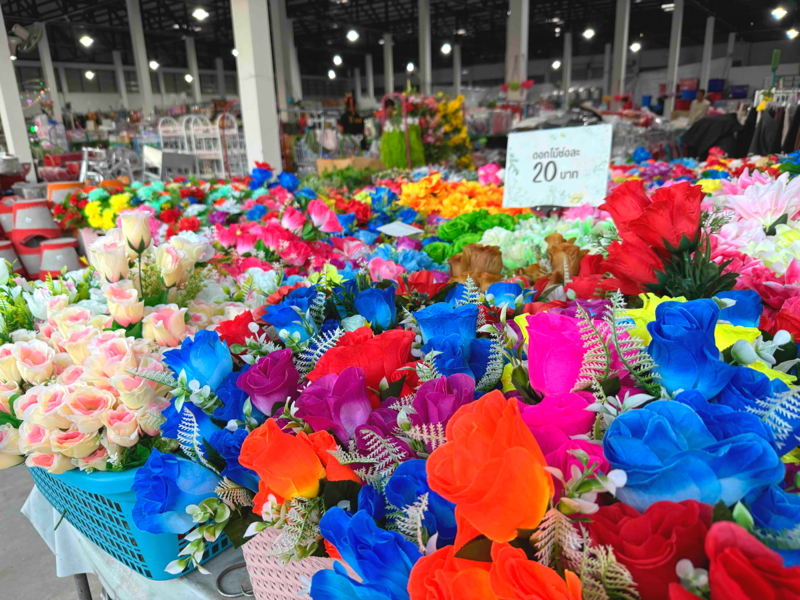</a>

<h2>化粧品はタイ仕様ですが、日本語表記を残したまま !</h2>

<a href="20241231_013.JPG" target="_blank">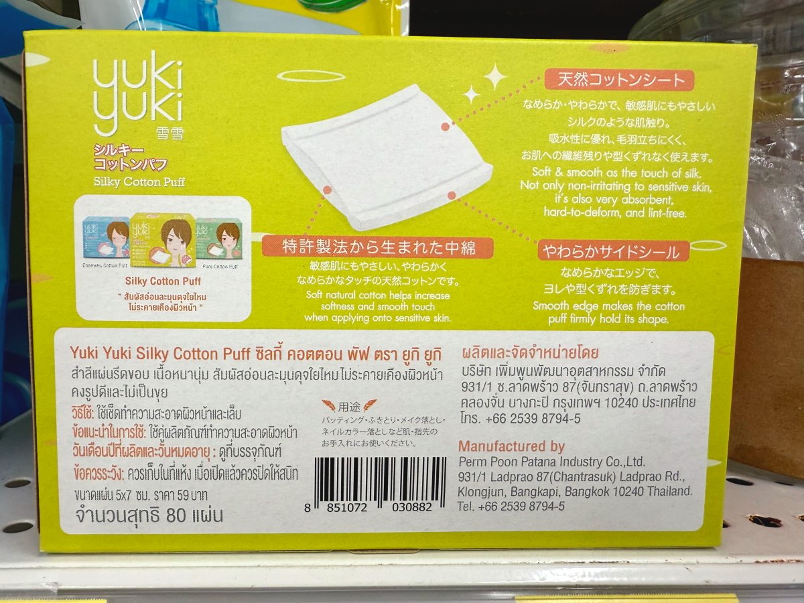</a>

<h2>綺麗なお花の写真集 !</h2>
<a href="20241231_015.JPG" target="_blank">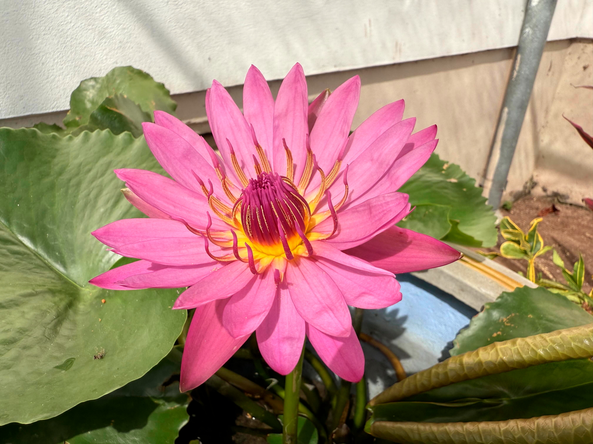</a>
<a href="20241231_016.JPG" target="_blank">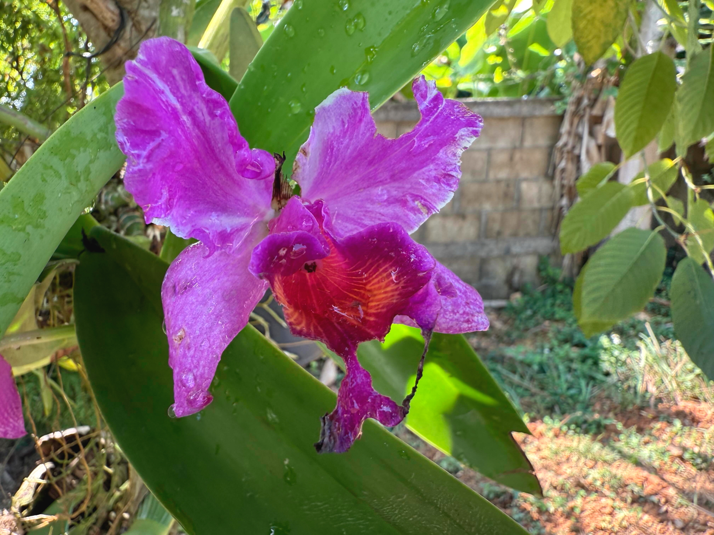</a>
<a href="20241231_017.JPG" target="_blank">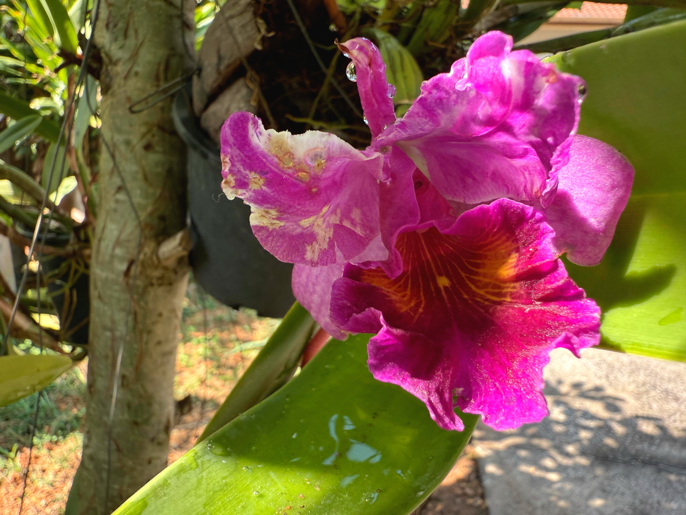</a>
<a href="20241231_018.JPG" target="_blank">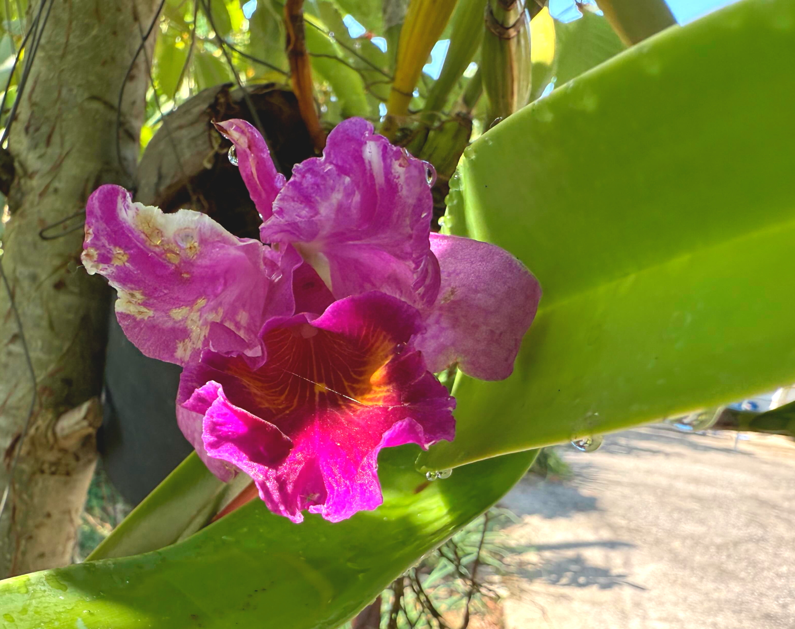</a>

<h2>最後は毎日見ても見飽きない綺麗な夕焼けグラデーション !</h2>

   
<h2>
<a href="https://torokoid.github.io/20241126_chiangrai/" target="_blank">Back to the menu page</a>
</h2>

   

         

  

      

<!--本体はここまで-->

<!--画面に空白地帯を作って、背景が見えるようにしています-->
                                              

<!-- フッタ -->
<footer>

Copyright 2024/12/31 alis @ChiangRai

</footer>

<!--HPにさまざまなJavaScriptを呼び込むための書式-->

